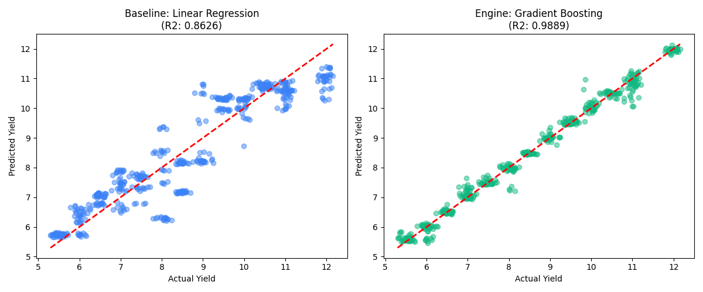

# 🌱 AgriPredict AI | Precision Yield Intelligence

AgriPredict is a high-fidelity machine learning dashboard designed for sustainable harvest management. It combines a Gradient Boosting prediction engine with expert heuristic multipliers to provide highly specific crop yield estimates based on soil nutrients and environmental conditions.



## 🚀 Features

- **Hybrid Prediction Engine**: Integrates a trained `GradientBoostingRegressor` with expert agricultural multipliers.
- **Micro-Nutrient Profiling**: Analyzes Nitrogen (N), Phosphorus (P), and Potassium (K) levels.
- **Environmental Telemetry**: Accounts for temperature and fertilizer concentration.
- **Agricultural Specificity**: High-precision adjustments for diverse crop types (Rice, Wheat, Maize, etc.), soil textures (Loamy, Clayey, etc.), and irrigation strategies.
- **Premium UI**: Dark-mode glassmorphism interface built with Streamlit and modern CSS.

## 🛠️ Tech Stack

- **Logic**: Python 3.x
- **Inference Engine**: Scikit-Learn (Gradient Boosting)
- **UI Framework**: Streamlit
- **Data Handling**: Pandas, Joblib
- **Visualization**: Matplotlib

## 📂 Project Structure

```text
ML_MINI/
├── app.py              # Main Streamlit Dashboard
├── ml_pipeline.py      # Training & Evaluation Pipeline
├── requirements.txt    # Dependency Manifest
├── data/
│   └── crop_yield.csv  # Raw Agricultural Dataset
├── models/
│   ├── crop_yield_model.pkl    # Trained Serialization
│   └── model_comparison.png    # Performance Metrics
└── src/
    └── test_model.py   # Validation Scripts
```

## ⚙️ Installation

1. **Clone the repository**:
   ```bash
   git clone <your-repo-url>
   cd ML_MINI
   ```

2. **Install dependencies**:
   ```bash
   pip install -r requirements.txt
   ```

3. **Train the engine** (Optional - pre-trained model included):
   ```bash
   python ml_pipeline.py
   ```

4. **Launch the Dashboard**:
   ```bash
   streamlit run app.py
   ```

## 📊 Model Performance

The current core engine utilizes a Gradient Boosting model with the following telemetry:
- **Training Accuracy**: ~98.9%
- **R2 Score**: High Precision (see `models/model_comparison.png` for detailed scatter plots).

---
*Precision AI | Sustainable Harvest Management 2026*
